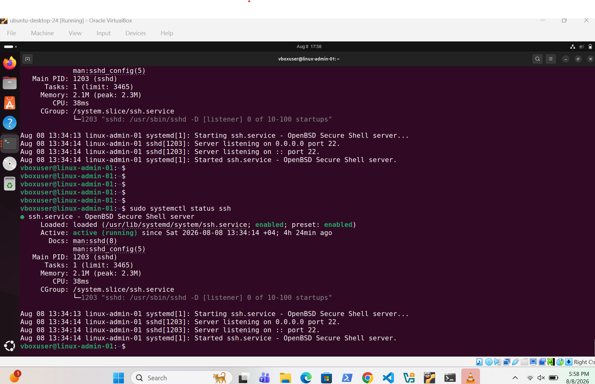
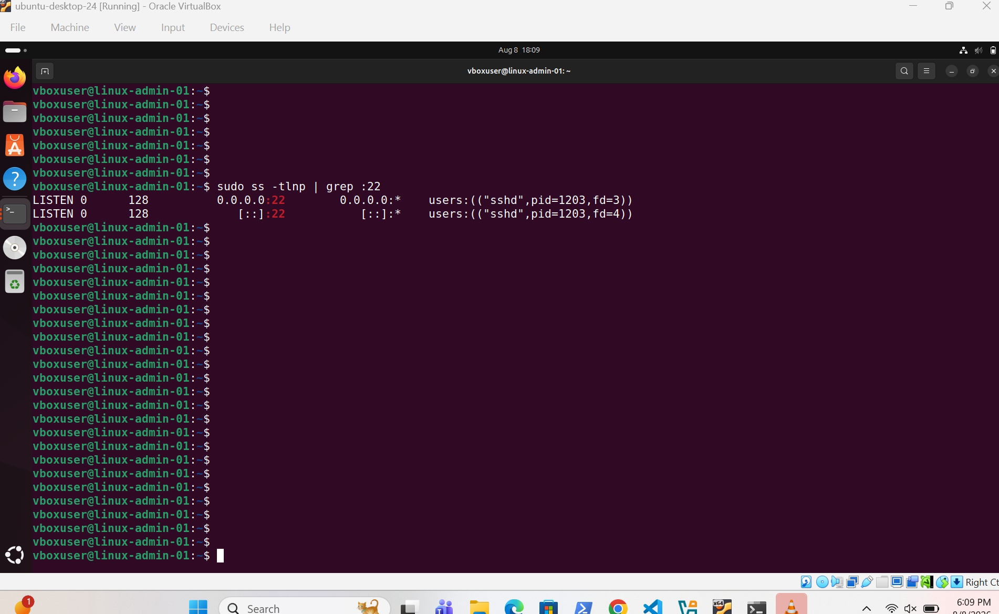
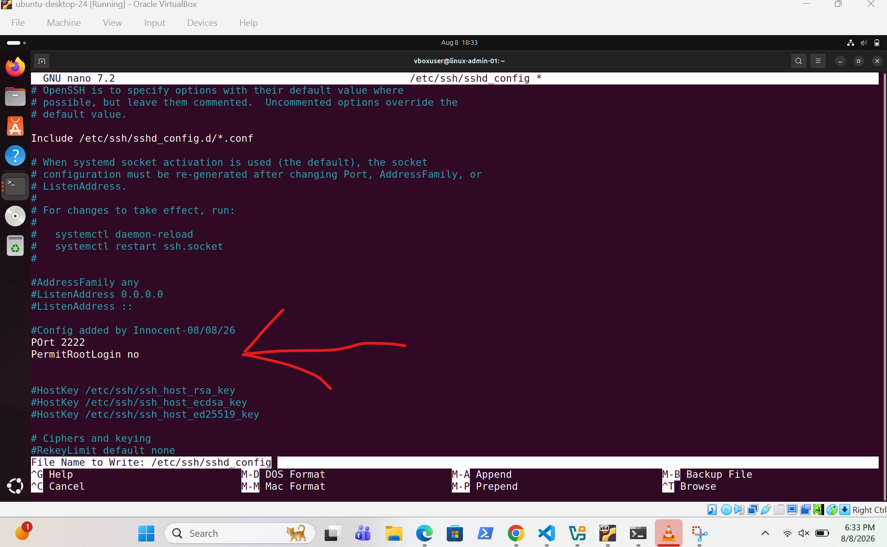
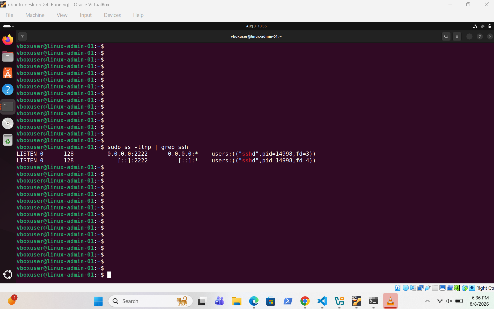
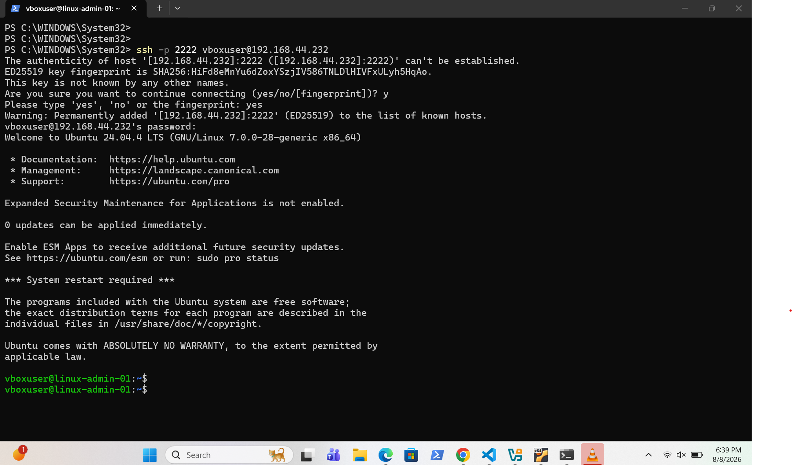

# SSH Server Configuration

---

## Screenshots

### SSH Server Installation

OpenSSH Server was successfully installed on Ubuntu, enabling secure remote administration capabilities.

---

### SSH Service Status

Verified that the SSH service was running correctly and accepting connections on the default SSH port (22).

---

### SSH Configuration Update

The SSH server configuration file (`sshd_config`) was updated to change the default SSH listening port.

---

### Custom SSH Port Verification

Confirmed that the SSH service was successfully listening on the new custom port (2222), proving the configuration changes were applied successfully.

---

### Remote SSH Access from Windows

Successfully established a secure SSH connection from a Windows client to the Ubuntu server using the custom SSH port (2222), confirming successful remote administration.

