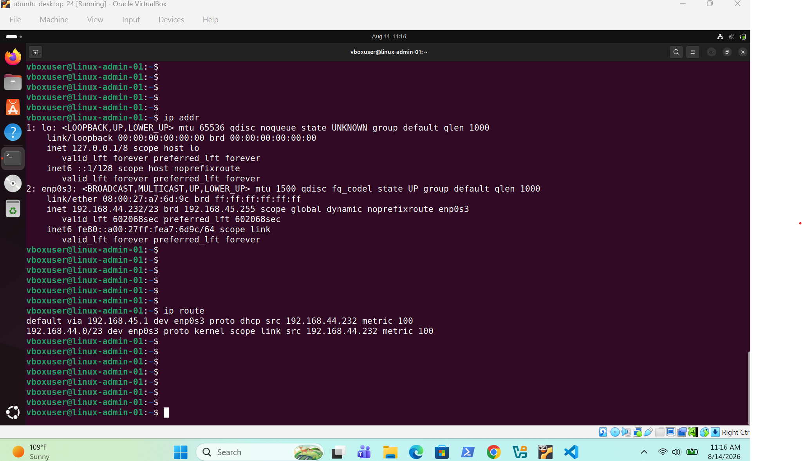
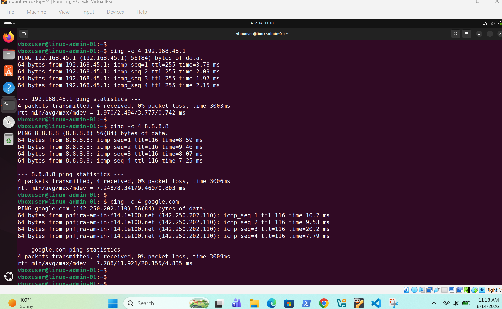
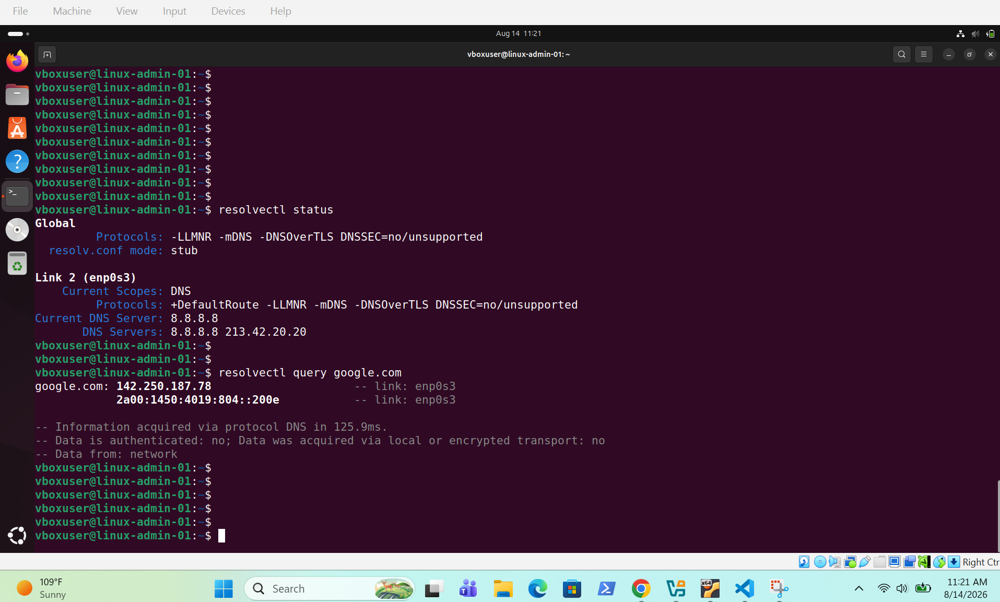
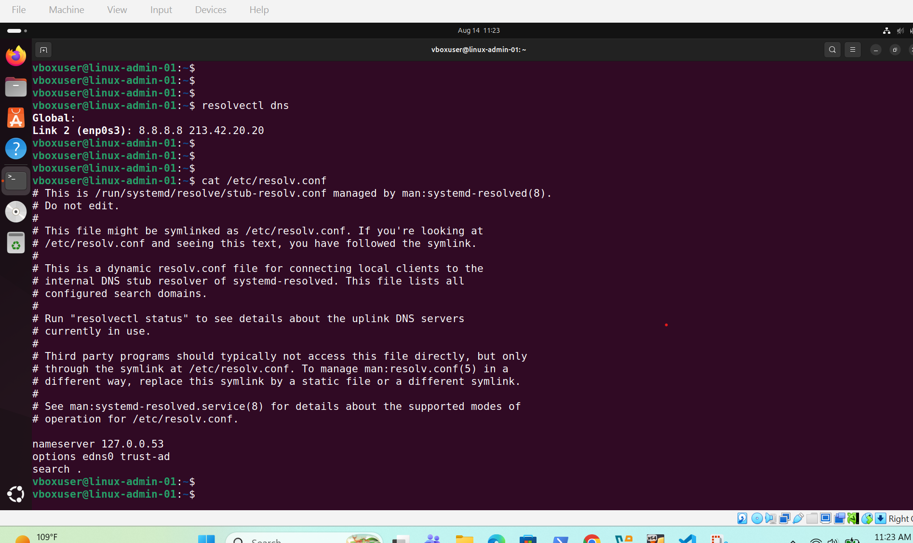
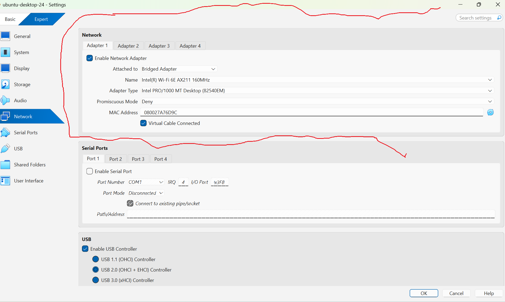
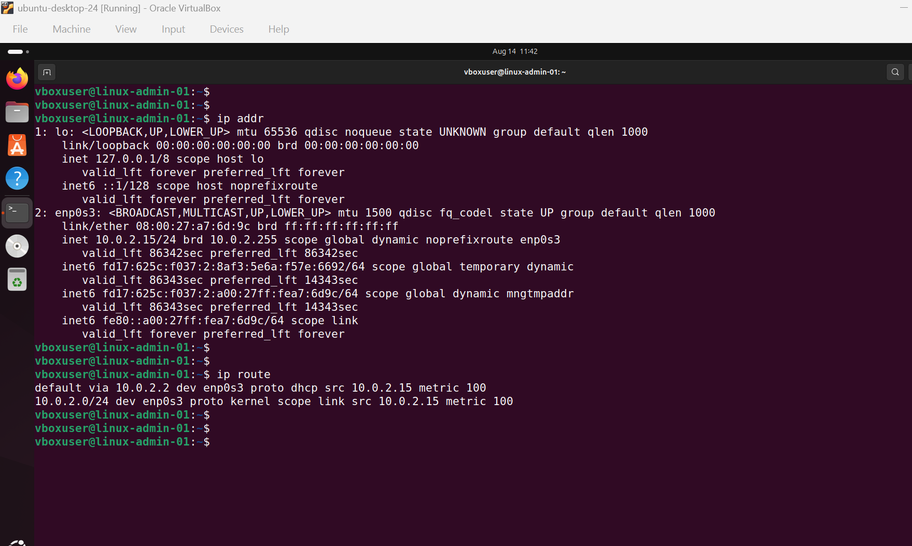
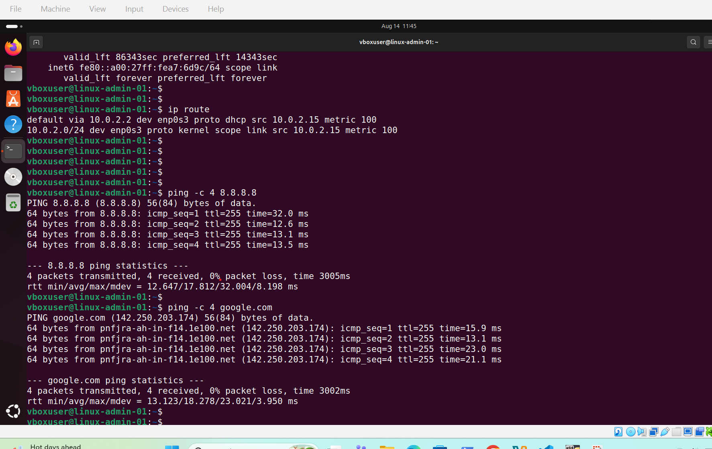

# Linux Networking

## IP Address and Route Verification

Verified the Linux network interface configuration, assigned IP address and default routing information.

---

## Network Connectivity Verification

Verified connectivity to the local network gateway using ICMP ping.

---

## DNS Verification

Verified DNS resolution by testing domain name connectivity from the Linux server.

---

## DNS Resolver Verification

Verified the active DNS resolver configuration and configured DNS servers using `resolvectl`.

---

## VirtualBox Bridged Adapter

Configured the VM with a VirtualBox Bridged Adapter and verified the assigned network address and route.

---

## VirtualBox NAT

Switched the VM to NAT networking and verified the new IP address and default gateway.

---

## Internet and DNS Connectivity

Verified Internet connectivity and DNS resolution with 0% packet loss.

