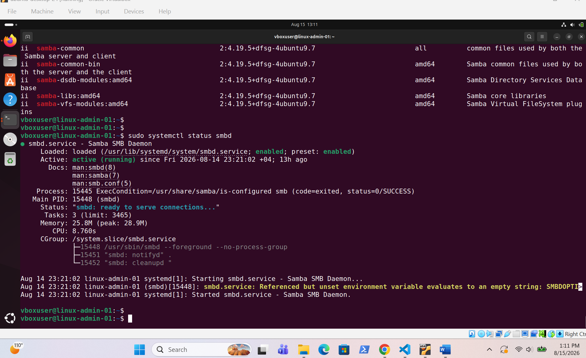
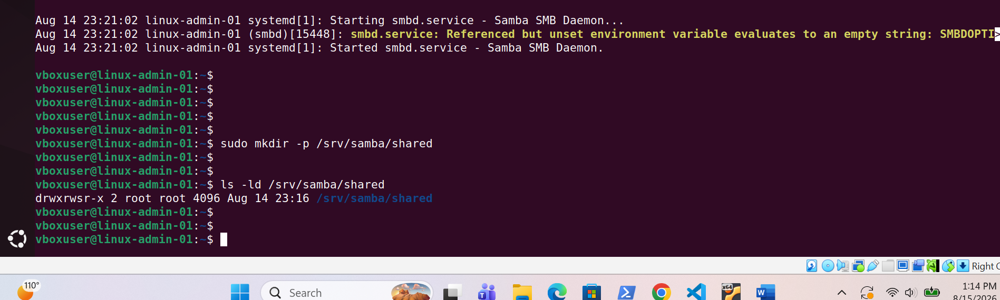
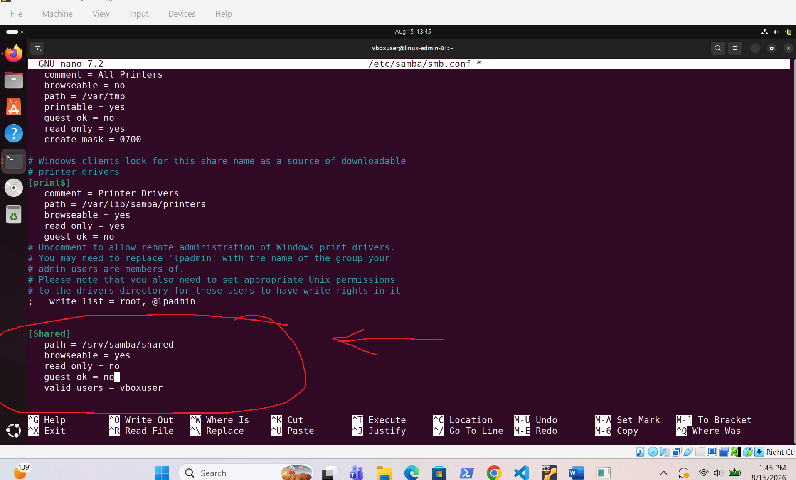
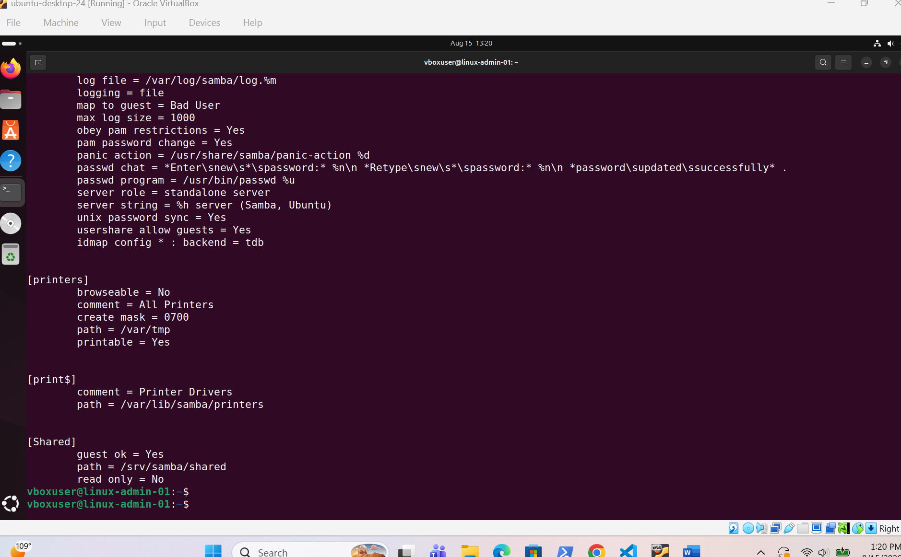
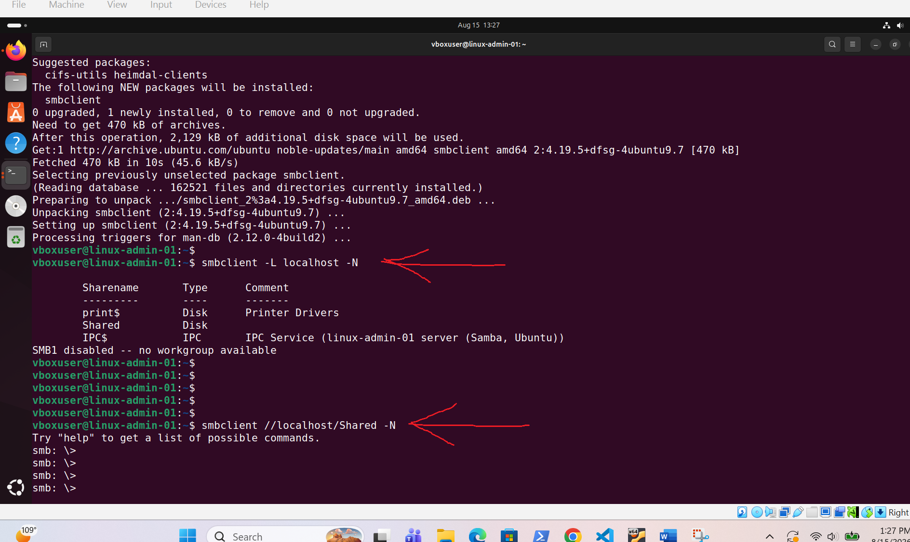
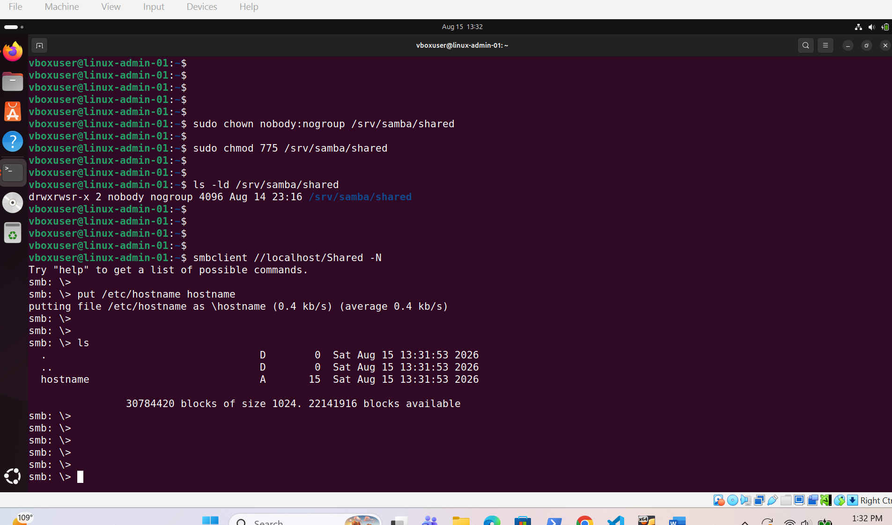
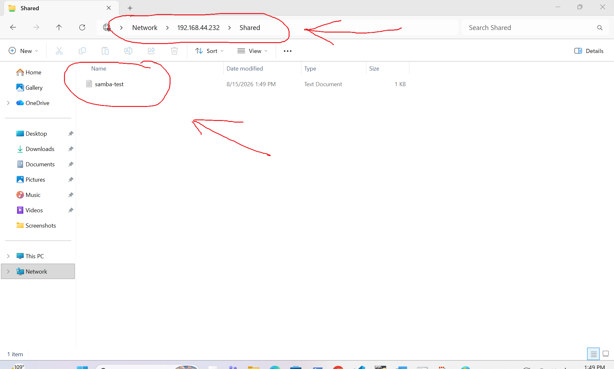

# Samba File Server

## Overview

Configured an Ubuntu Linux server as a Samba file server with an authenticated SMB shared folder and verified file access from a Windows client.

## Screenshots

### 1. Samba Service Status

Shows the Samba SMB service running successfully on the Ubuntu server.

---

### 2. Shared Directory

Shows the directory created for the Samba shared folder.

---

### 3. Samba Share Configuration

Shows the configured Samba `Shared` network share and its access settings.

---

### 4. Configuration Test

Shows the Samba configuration validated successfully using `testparm`.

---

### 5. Share List and Connection

Shows the `Shared` SMB share discovered and accessed using `smbclient`.

---

### 6. File Transfer

Shows successful file transfer through the Samba share.

---

### 7. Windows Share Verification

Shows the Samba shared folder successfully accessed from the Windows client.

