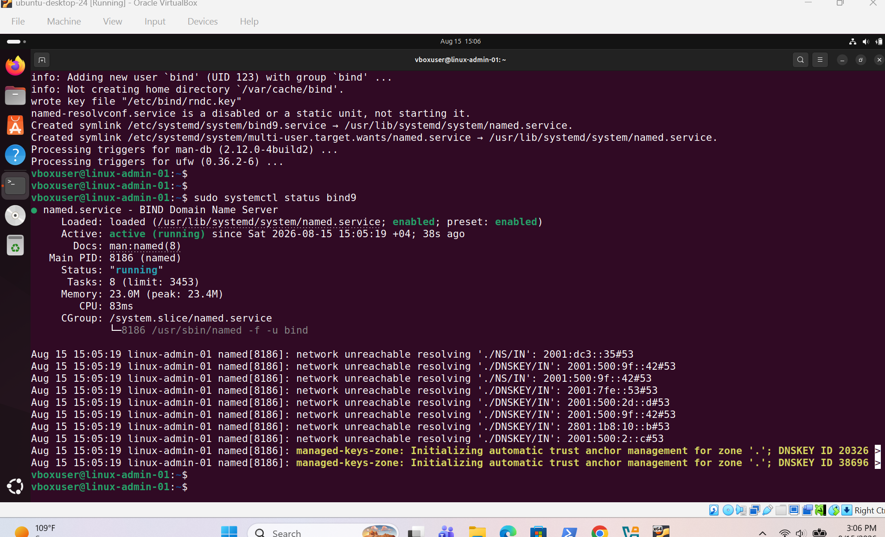
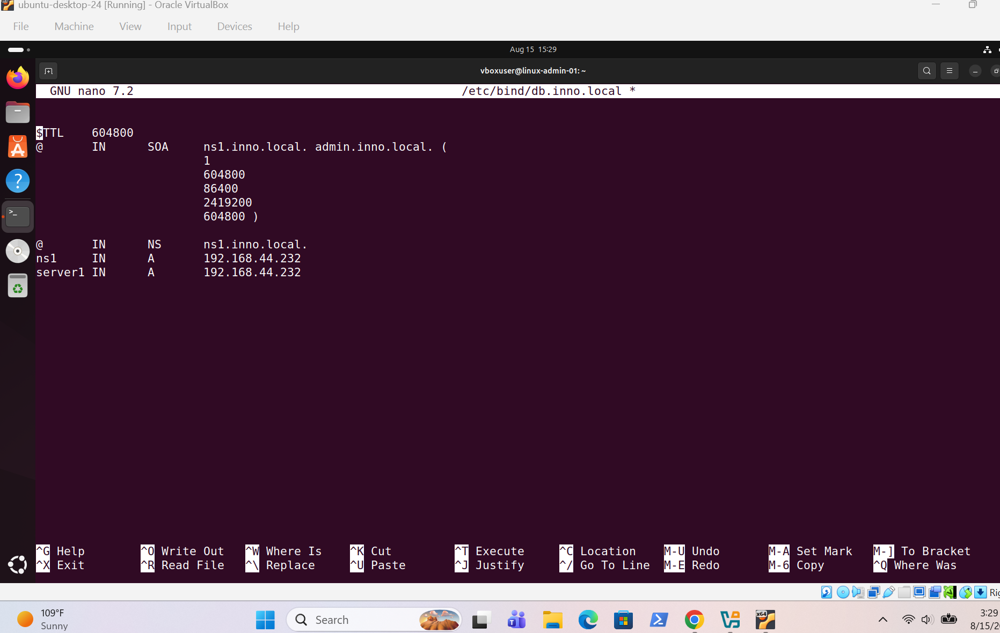
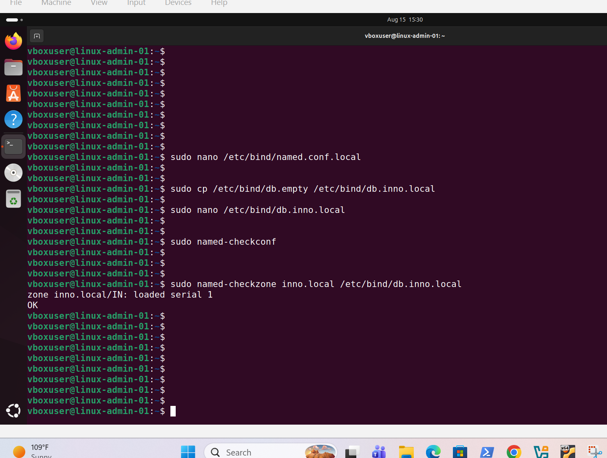
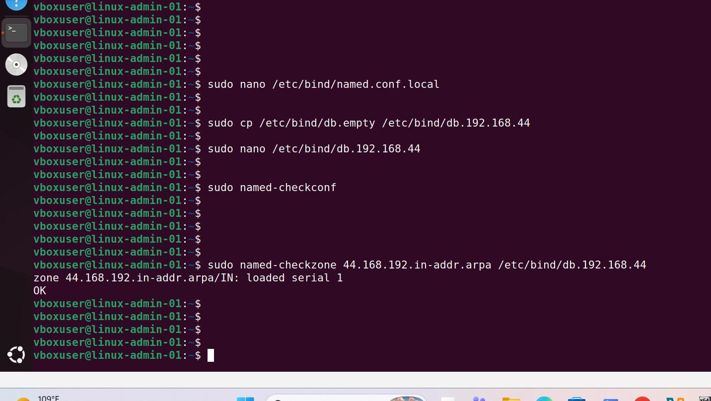
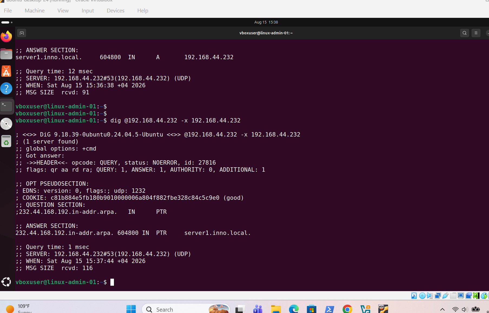
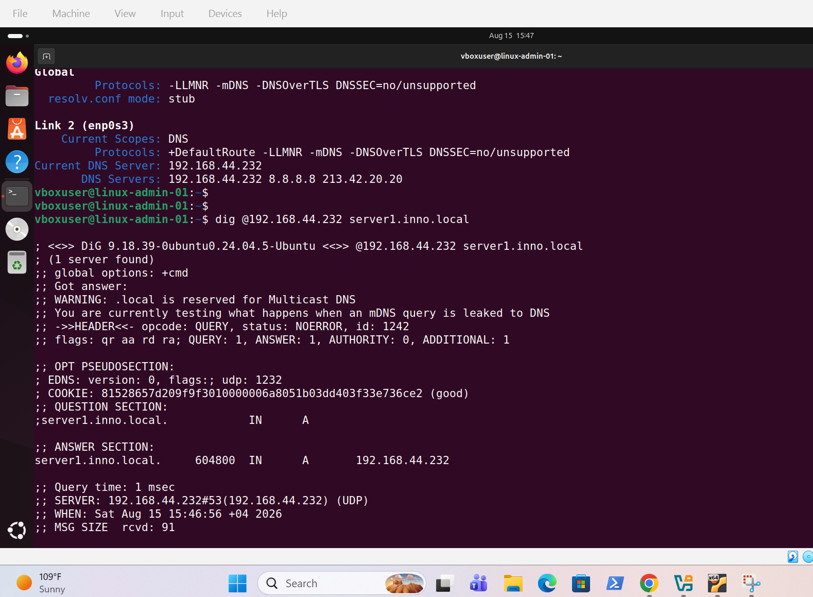
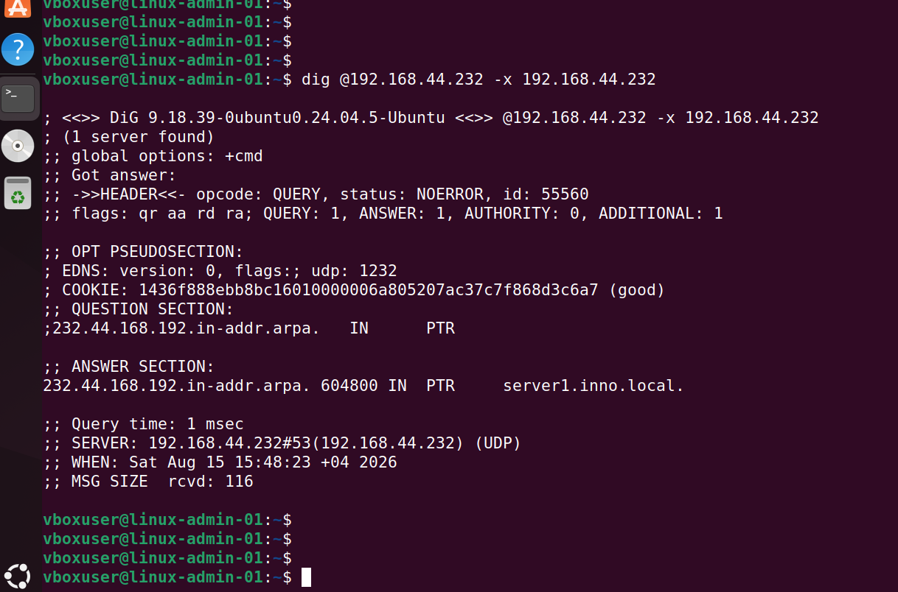

# DNS Server

## Screenshots

### 1. BIND Installation and Service

Shows BIND installed and the DNS service running.

---

### 2. DNS Server A Record

Shows the `server1.inno.local` A record configured.

---

### 3. Forward Zone Validation

Shows successful validation of the `inno.local` forward zone.

---

### 4. Reverse Zone Validation

Shows successful validation of the reverse DNS zone.

---

### 5. Forward and Reverse Lookup

Shows successful forward and reverse DNS lookup testing.

---

### 6. Forward DNS Lookup

Shows `server1.inno.local` resolving to `192.168.44.232`.

---

### 7. Reverse DNS Lookup

Shows `192.168.44.232` resolving to `server1.inno.local`.

