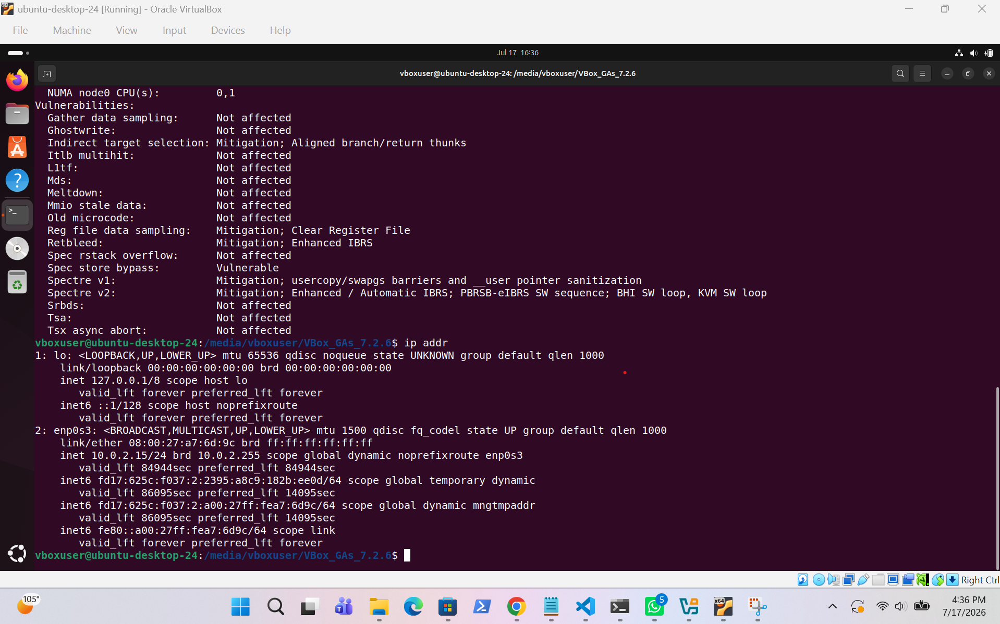

# Linux Server Build

## Overview

This project demonstrates the deployment and initial configuration of an Ubuntu 24.04 LTS virtual machine. The server was prepared for Linux administration by configuring the hostname, time zone, installing essential administration tools and verifying the operating system, hardware and network configuration.

---

## Screenshots

### System Verification

Shows the Ubuntu server configuration, operating system, kernel version, hostname and system information.

---

### Network Verification

Shows the server network configuration, storage and connectivity verification.

