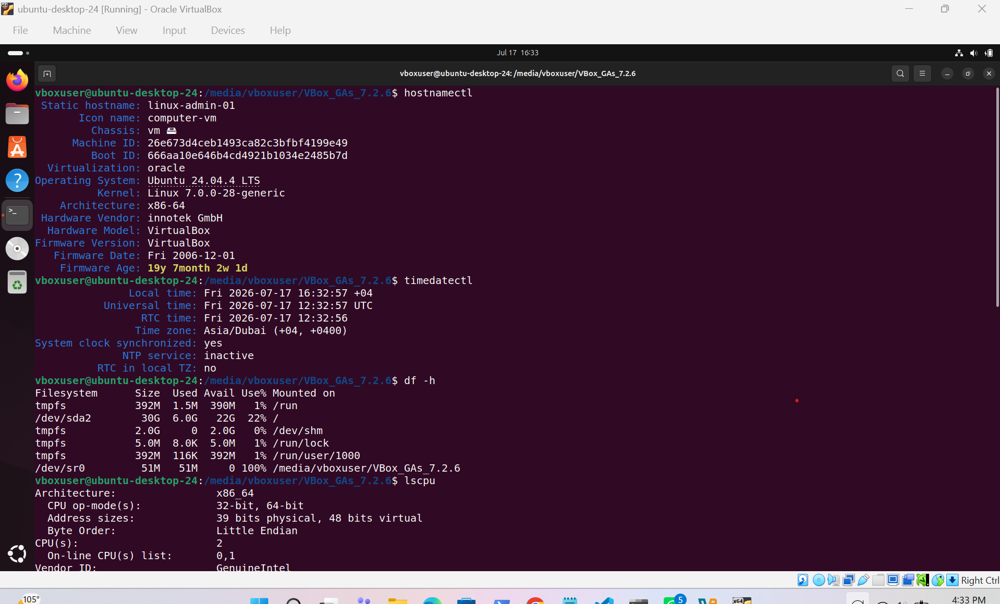

# Project 01 - Linux Server Build

Production-ready Ubuntu 24.04 LTS virtual machine prepared for Linux administration projects.

## Environment

- Ubuntu 24.04.4 LTS
- Oracle VirtualBox
- Linux Kernel 7.0.0-28-generic
- x86-64 Architecture

## Configuration

- Operating system updated
- Hostname configured (`linux-admin-01`)
- Time zone configured (`Asia/Dubai`)
- Essential administration tools installed
- CPU, storage and network verified

## Technologies

- Ubuntu Linux
- Bash
- APT
- Oracle VirtualBox

## Screenshots

### System Verification

### Network Verification

