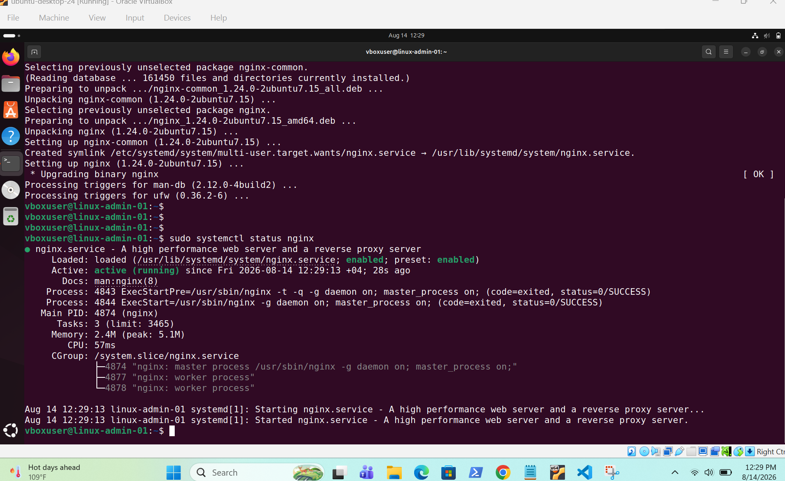
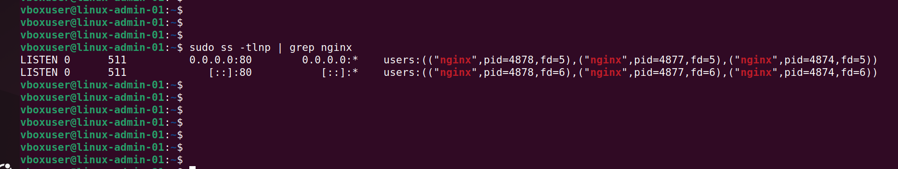
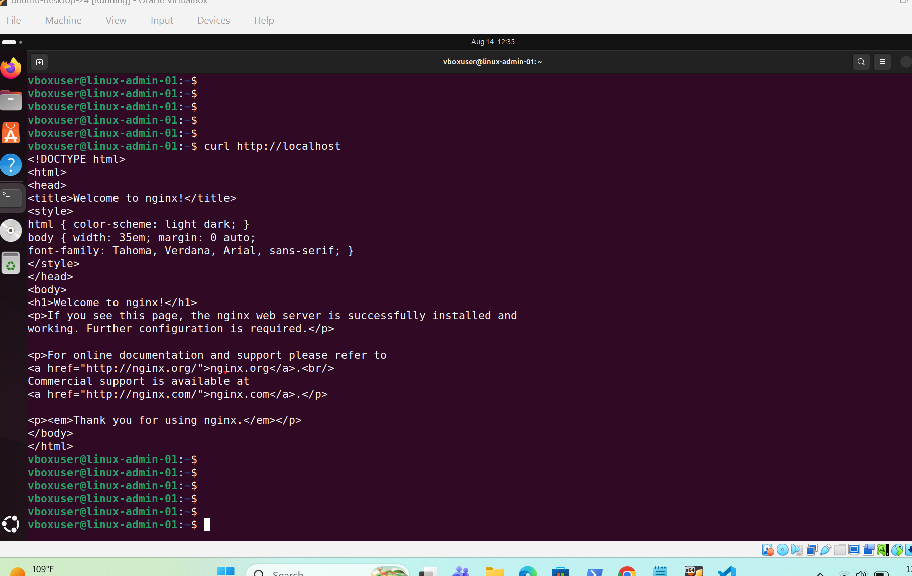
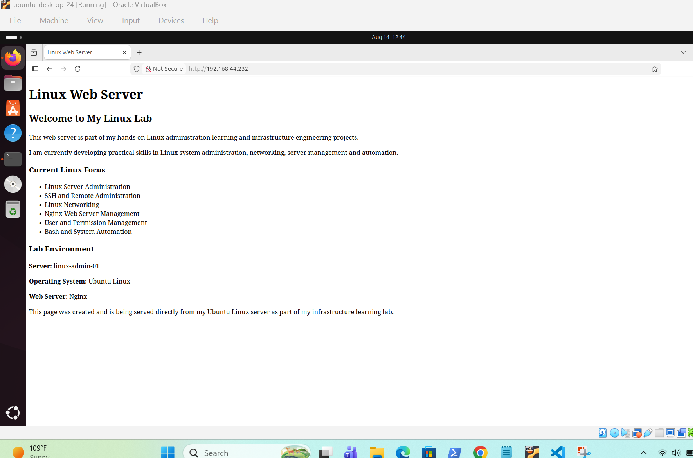
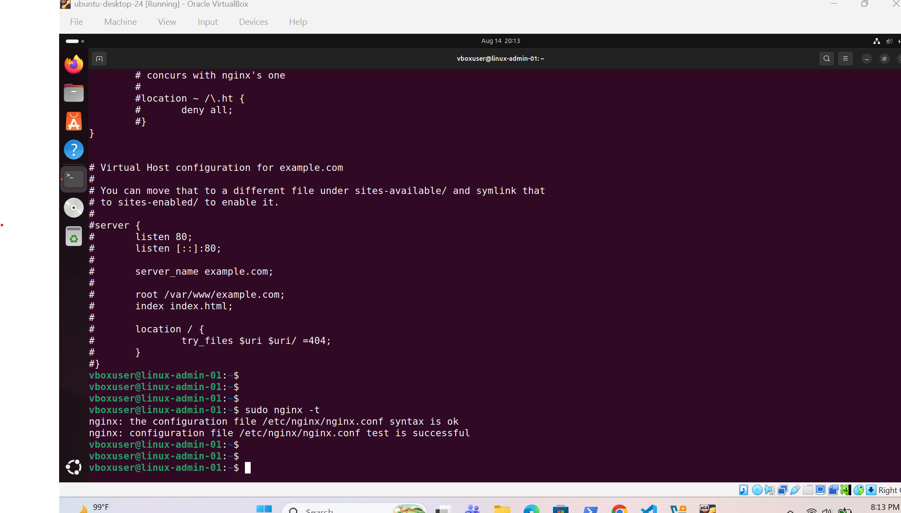
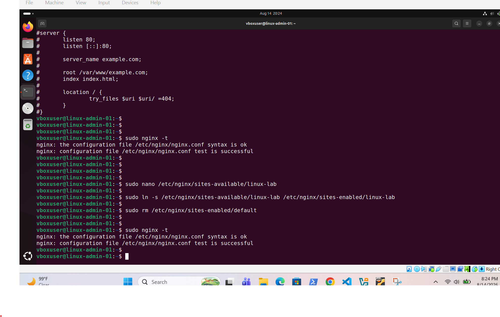
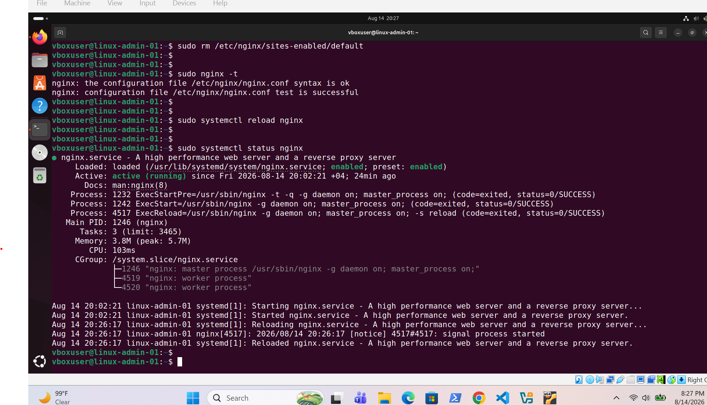
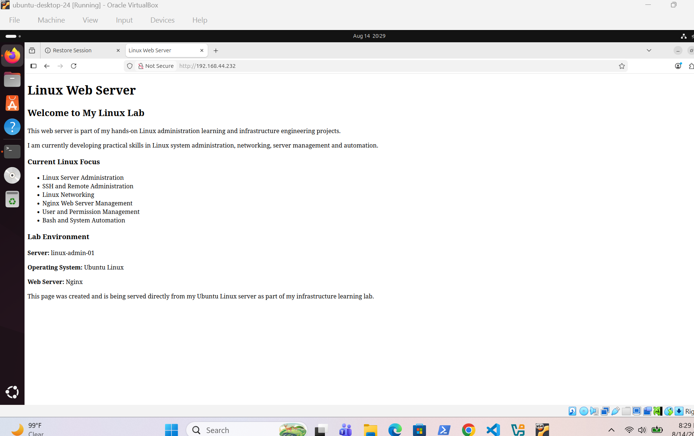
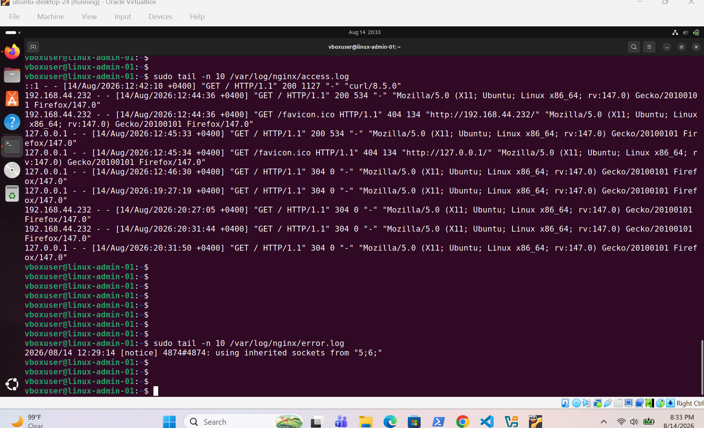

# Nginx Web Server

## Nginx Server Installation

Installed Nginx on the Ubuntu Linux server and verified that the service is active and running.

---

## Nginx Port 80 Verification

Verified that Nginx is listening for HTTP connections on TCP port 80.

---

## Local Web Server Test

Tested the Nginx web server locally using `curl` and confirmed that the default web page was being served successfully.

---

## Custom Web Page

Created and deployed a custom HTML page on the Linux server and configured Nginx to serve the page.

---

## Nginx Configuration Test

Tested the Nginx configuration syntax and verified that the configuration was valid.

---

## Nginx Site Configuration

Created a custom Nginx site configuration and enabled it using the `sites-enabled` directory.

---

## Nginx Reload and Service Verification

Reloaded Nginx after applying the configuration changes and verified that the service remained active and running.

---

## Custom Site Verification

Accessed the server from a web browser using its IP address and verified that the custom Linux web page was being served successfully.

---

## Nginx Access and Error Logs

Reviewed the Nginx access and error logs to verify client requests and monitor server activity.

