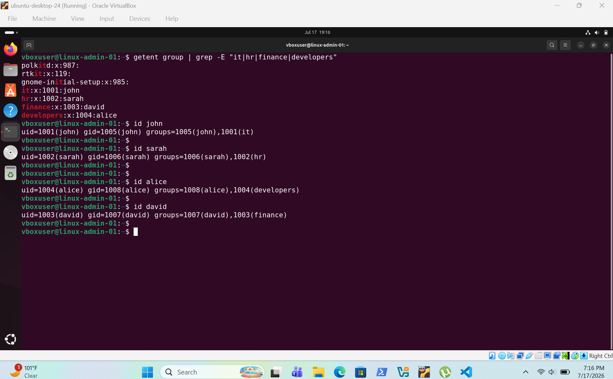
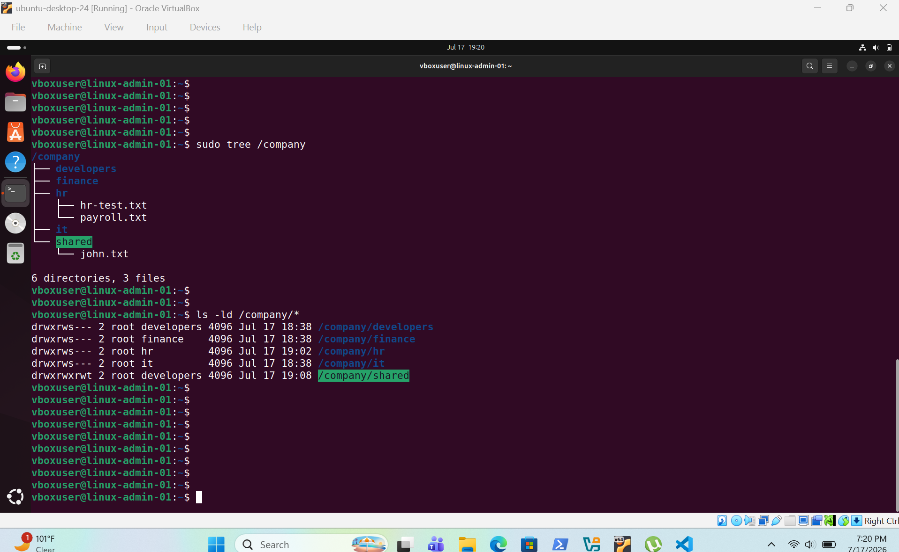
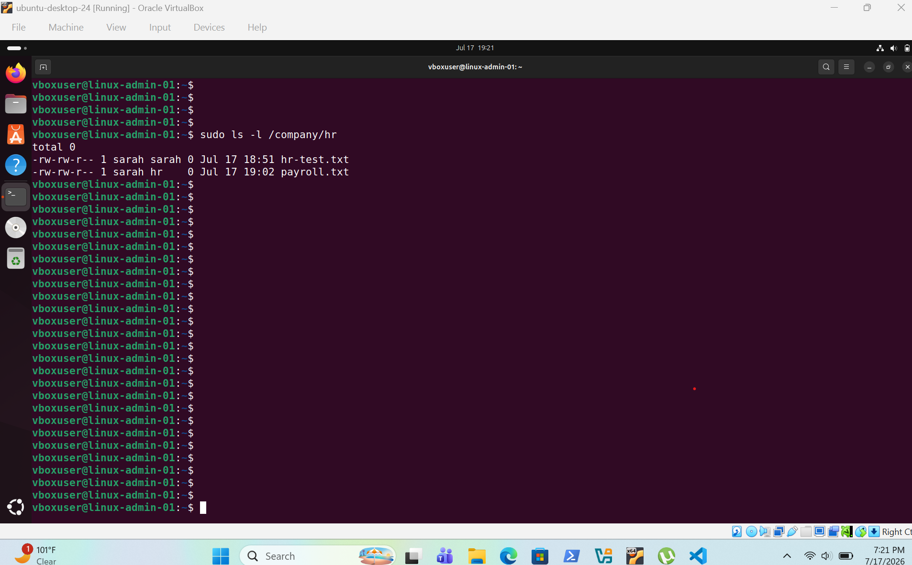
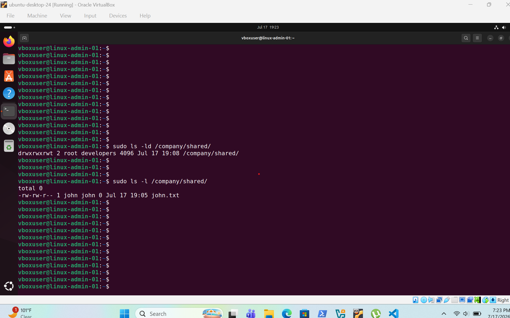

# User & Group Management

## Overview

This project demonstrates Linux user and group administration by creating department groups, managing user accounts, assigning group memberships and configuring secure directory permissions using `chown`, `chmod`, SGID and Sticky Bit. Access control was verified to ensure users could only access authorized resources.

---

## Screenshots

### Group Verification

Shows the department groups, user accounts and group memberships configured on the Linux server.

---

### Directory Permissions

Shows the department directory structure, ownership and Linux file permissions configured using `chown` and `chmod`.

---

### SGID Verification

Shows SGID configured on department directories, ensuring new files inherit the parent directory's group ownership.

---

### Sticky Bit Verification

Shows the shared directory configured with the Sticky Bit, allowing users to create files while preventing them from deleting files owned by other users.

